# 项目功能说明

1. 提供一个数据库前端网页，支持显示运行结果，tokens，ast，plan，错误，缓存等信息，支持查看数据库中已存在的表的内容。

   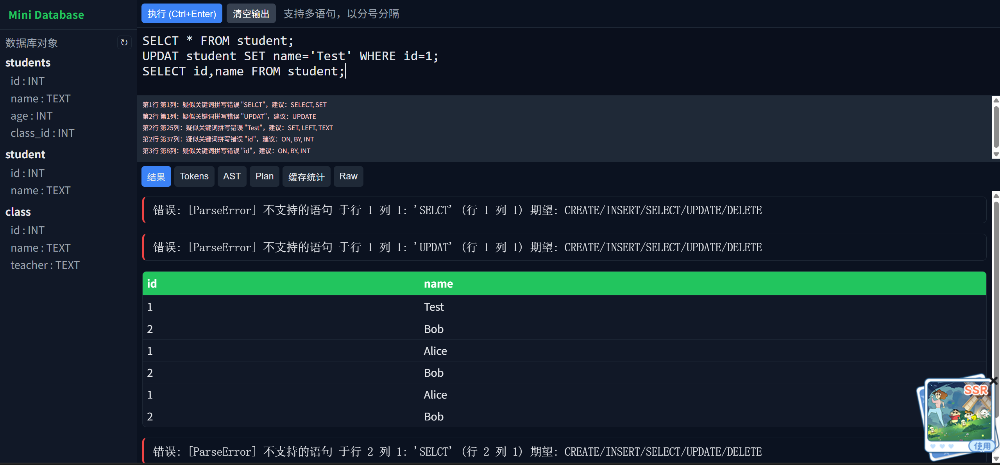

2. 建表功能（CREATE）："CREATE TABLE student(id INT, name TEXT);"。

   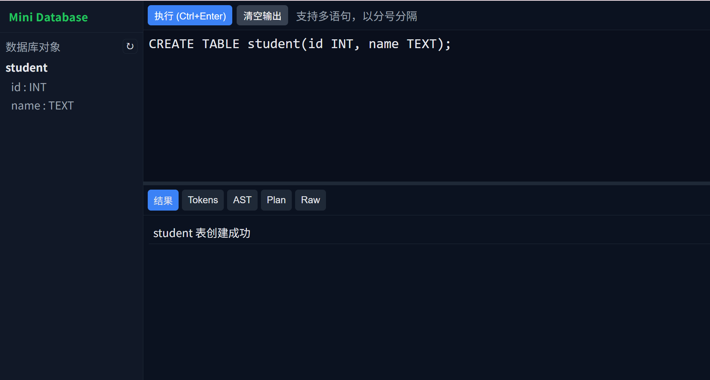

   错误情况：表已存在，列名重复，不支持的类型。

3. 插入记录（INSERT）："INSERT INTO student(name, id) VALUES ('Alice', 1);"，"INSERT INTO student VALUES (2, 'Bob');"。

   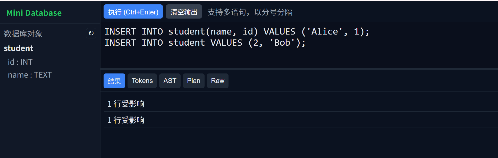

   错误情况：表不存在，列不存在，INSERT 值个数不一致: 期望 {expected_count}, 实际 {len(stmt.values)}，类型不匹配。

4. 搜索功能（SELECT）："SELECT * FROM students;", "SELECT id,name FROM students WHERE id = 3 AND age >= 20;"。

   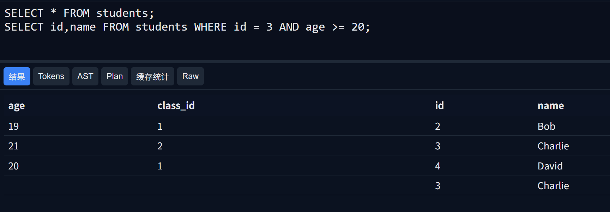

   错误情况：表不存在，列不存在，类型不匹配。

5. 删除功能（DELETE）："DELETE FROM students WHERE id = 2 AND age > 18;", "DELETE FROM student;"。

   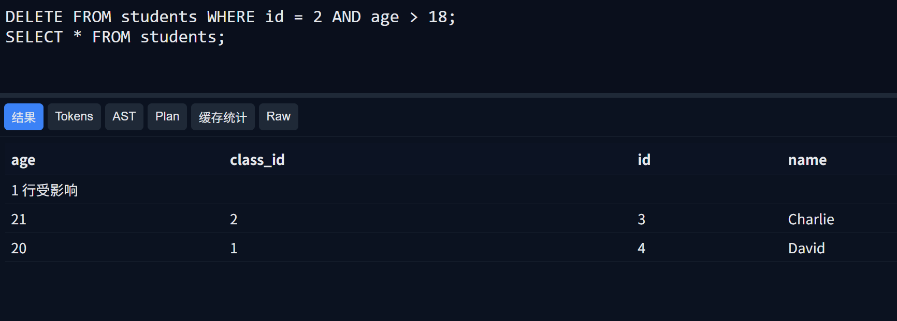

   错误情况：表不存在，列不存在。

6. 缓存命中分析功能，支持输出替换页的 log日志，支持重置记录。

   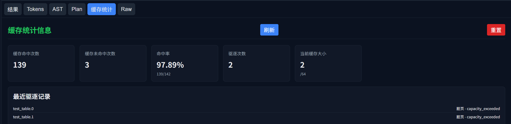

7. 更新功能（UPDATE）："UPDATE students SET name='H' WHERE id = 3 AND age >= 18;"。

   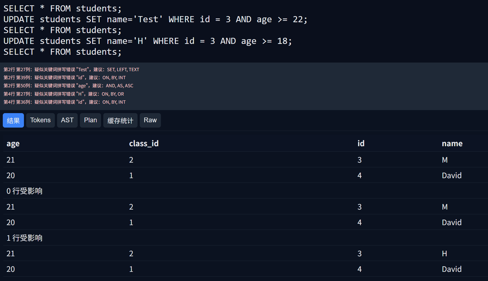

8. 连接功能（JOIN）："SELECT s.name, c.name as class_name FROM students s JOIN class c ON s.class_id = c.id;"。

   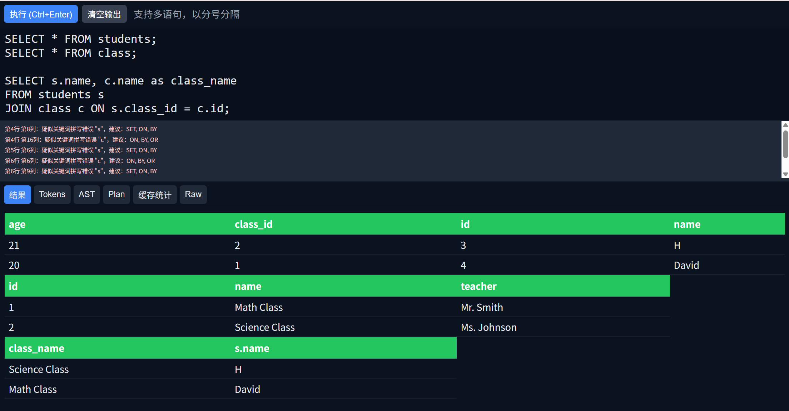

   左连接（LEFT JOIN）：

   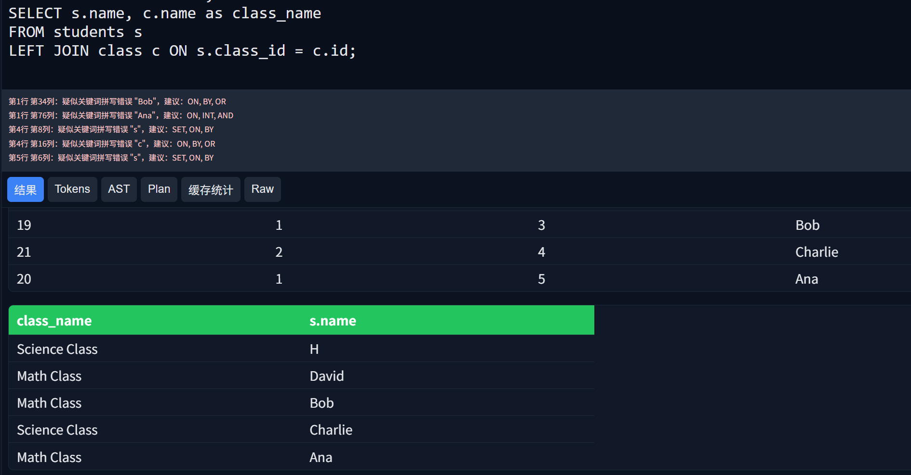

9. 排序功能（ORDER BY）：

   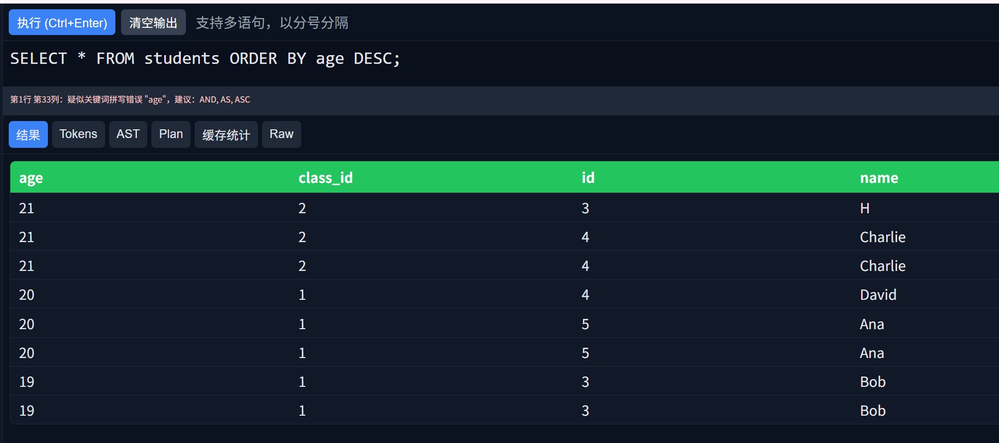

10. 聚合函数（COUNT，SUM，AVG，MIN，MAX）："SELECT COUNT(*), AVG(age), MAX(age), MIN(age) FROM student;"。

   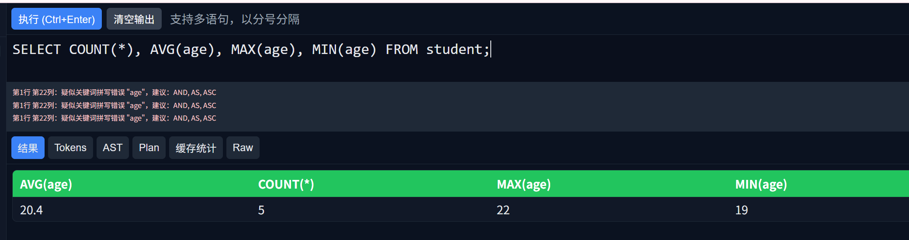

11. 分组功能（GROUP BY）："SELECT class_id, COUNT(*) FROM student GROUP BY class_id;"。

    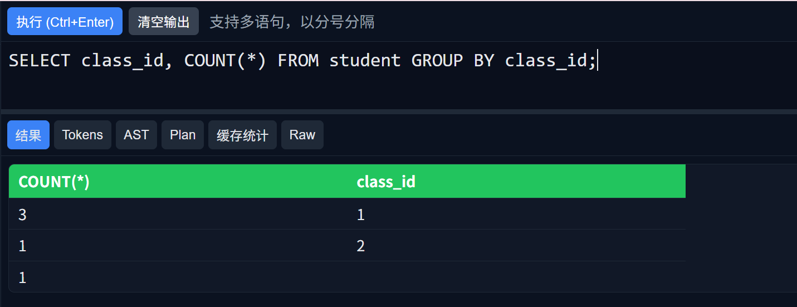

12. 谓词下推功能，两个条件都被下推到扫描阶段，形成过滤链，逐层减少数据量。

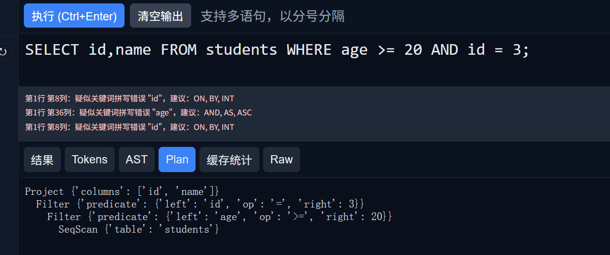

13. 智能纠错提示。

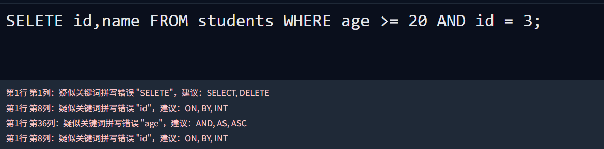